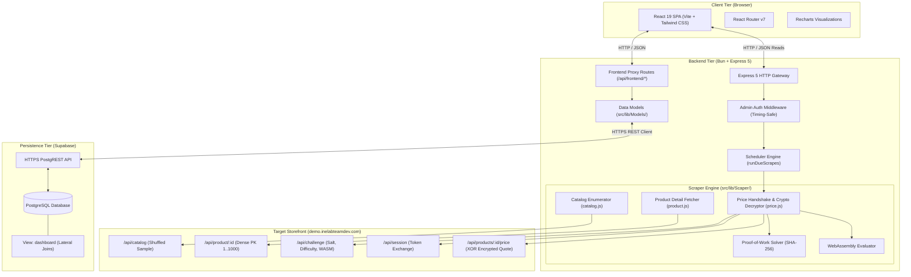
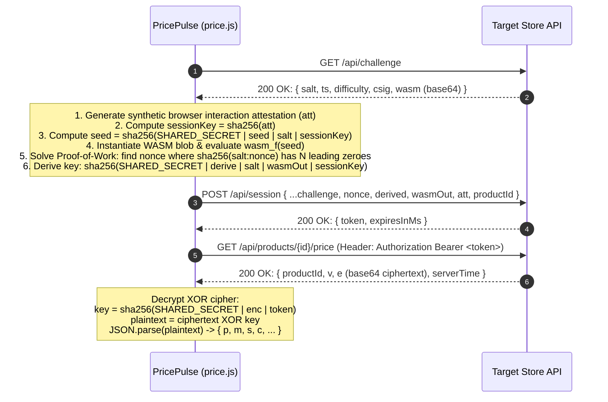
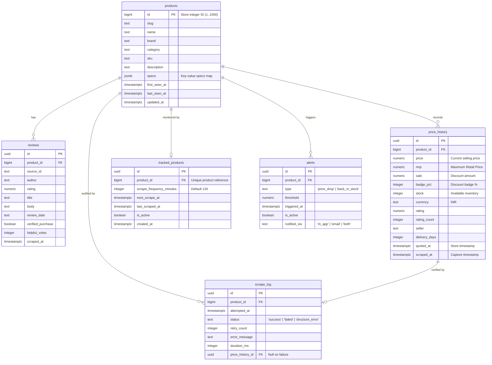
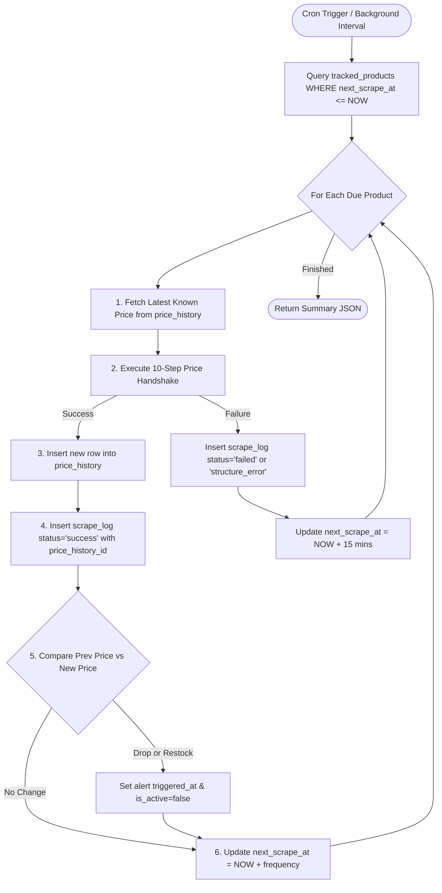

# PricePulse ⚡
> **Resilient E-Commerce Price & Stock Tracking System**
> 
> *A distributed price monitoring solution engineered to reverse-engineer hostile storefront anti-scraping defenses, handle flaky networks honestly, and maintain high-fidelity historical audits.*

---

## 📑 Table of Contents

1. [System Architecture Overview](#-system-architecture-overview)
2. [The Core Problem & Target Store Hostility](#-the-core-problem--target-store-hostility)
3. [Deep Dive: How the Scraper Works](#-deep-dive-how-the-scraper-works)
   - [Challenge A: Non-Paginated Shuffled Catalog](#challenge-a-the-catalog-is-not-paginated-coupon-collector-trap)
   - [Challenge B: 10-Step Price Handshake & Anti-Bot Bypasses](#challenge-b-the-price-is-behind-a-10-step-handshake)
   - [Challenge C: Flakiness & Error Taxonomy](#challenge-c-the-store-is-flaky-by-design)
   - [Challenge D: Scheduling on Free-Tier Sleeping Hosts](#challenge-d-scheduling-on-a-box-that-sleeps)
4. [Database Architecture & Data Modeling](#-database-architecture--data-modeling)
   - [Entity-Relationship Diagram](#entity-relationship-erd)
   - [Tables & Schemas](#tables--schemas)
   - [The `dashboard` View (Postgres Lateral Joins)](#the-dashboard-view-lateral-joins)
   - [Three-Pass Fill Strategy & Schema Invariants](#three-pass-fill-strategy--schema-invariants)
5. [Backend Architecture & Module Structure](#-backend-architecture--module-structure)
6. [Frontend Web Application](#-frontend-web-application)
7. [HTTP API Specification](#-http-api-specification)
   - [Public Endpoints](#1-public-endpoints-no-auth)
   - [Frontend Proxy Endpoints (Browser-Safe)](#2-frontend-proxy-endpoints-no-admin-secret-required)
   - [Admin Endpoints (Protected)](#3-admin-endpoints-requires-admin_secret)
8. [End-to-End Data Flows](#-end-to-end-data-flows)
9. [Local Development & Setup Guide](#-local-development--setup-guide)
   - [Prerequisites](#prerequisites)
   - [1. Backend Setup](#1-backend-setup)
   - [2. Database Setup (Supabase)](#2-database-setup-supabase)
   - [3. Frontend Setup](#3-frontend-setup)
   - [CLI Operations & Diagnostic Scripts](#cli-operations--diagnostic-scripts)
10. [Engineering Principles & Best Practices](#-engineering-principles--best-practices)

---

## 🏛 System Architecture Overview

PricePulse consists of three primary tiers:
1. **Frontend (Vercel / Local Vite Dev Server)**: Modern React 19 SPA built with Tailwind CSS v4, Recharts, and Lucide React.
2. **Backend API & Worker (Render / Bun Runtime)**: Express 5 microservice running on the high-performance Bun JavaScript runtime. Handles scraping, rate limiting, proof-of-work challenge solving, scheduling, and database mutations.
3. **Database & Persistence (Supabase / Managed PostgreSQL)**: Relational schema with PostgREST HTTPS connectivity, Row-Level Security (RLS), and SQL views with lateral joins.



---

## 🎯 The Core Problem & Target Store Hostility

The target storefront (`https://demo.inelabteamdev.com`) is **deliberately engineered to deceive and block naive web scrapers**. 

### 1. It is an Empty React SPA Shell
A plain HTTP `GET` to the store returns ~459 bytes of bare HTML:
```html
<body><div id="root"></div></body>
```
Traditional DOM scrapers (e.g., `cheerio`) find zero headings, zero links, and zero prices. Spawning headless browsers (Playwright/Puppeteer) consumes extreme CPU/RAM and fails on free cloud tiers.

* **Solution**: PricePulse reverse-engineers the underlying JSON network requests from the bundled assets (`/assets/index-*.js`), scraping direct API endpoints with lightweight HTTP requests.

### 2. Chaotic Flakiness by Design
The client bundle embeds deliberate chaos wrappers:
```javascript
function Xn(e){
  return()=>{
    if(Math.random()<.35){
      if(Math.random()<.5) return;
      window.setTimeout(e, 900);
      return;
    }
    e();
  }
}
```
Around 35% of all client requests are dropped or delayed by 900ms. Furthermore, the store issues aggressive HTTP `429` rate-limits and `503` service errors after short bursts of 15–25 requests.

* **Solution**: A structured retry framework powered by `p-retry` using exponential backoff, jitter, and named retry budgets tailored per endpoint.

---

## 🔍 Deep Dive: How the Scraper Works

### Challenge A: The Catalog is Not Paginated (Coupon-Collector Trap)

The endpoint `/api/catalog` reports `total: 1000`, `pages: 50`, and `pageSize: 20`. A standard pagination loop:
```javascript
for (let page = 1; page <= 50; page++) { /* collect 20 items */ }
```
**This fails catastrophically.** The store does **not** tile pages; it reshuffles the entire 1,000-product pool on every single request. Successive fetches of the same page return completely disjoint IDs:
```
GET /api/catalog?page=27 -> IDs: [483, 917, 823, 230]
GET /api/catalog?page=27 -> IDs: [752, 711, 450, 693]
```
Under coupon-collector probability, 50 draws of 20 items from a 1,000-item pool yield only `1000 * (1 - 1/e) ≈ 632` distinct items. Naive scrapers miss ~37% of the catalog while falsely reporting "complete."

Additionally:
- `pageSize` is silently capped at 60 (requesting 1,000 silently clamps to 60).
- Query params like `sort=id`, `order=asc`, or `shuffle=false` are completely ignored.

#### The Breakthrough: Dense Primary Key Enumeration
Probing proved that `/api/product/{id}` responds for **every integer id in a dense `1..1000` sequence** (`id=1001` returns `404 Not Found`).
PricePulse discards catalog sampling and performs a **direct sequential enumeration of integer IDs (`1..N`)**:
1. Reads `total` from a single catalog call to establish a baseline bound.
2. Walks IDs sequentially: `404` confirms a product does not exist, while `200` yields the full product record.
3. Continues probing upwards past `total` until hitting a gap of 5 consecutive `404`s (`SWEEP_PROBE_GAP = 5`), ensuring future catalog additions are never missed.

---

### Challenge B: The Price is Behind a 10-Step Handshake

The product detail endpoint `/api/product/{id}` deliberately omits `price`, `mrp`, and `stock`. Price information resides at `/api/products/{id}/price` (**plural** `products`) and is guarded by an anti-bot challenge sequence.



#### Key Anti-Bot Bypass Mechanics:
1. **Synthetic Interaction Attestation (`buildAttestation`)**:
   - The store's backend rejects interactions lacking genuine mouse hover physics.
   - Requirements: $\ge 8$ cursor move coordinates, $\ge 600\text{ms}$ dwell duration, and `trusted: true`.
   - **Degenerate Fingerprint Protection**: If `canvas` or `gl` hashes are all zeroes (`"0000000000000000"`), the store immediately returns HTTP `401 Unauthorized`. PricePulse generates cryptographically pseudo-random 16-hex-character canvas and WebGL hashes to match realistic device fingerprints.
2. **WebAssembly & Proof of Work**:
   - Compiles and instantiates the dynamic WASM binary exported by `/api/challenge` directly in memory using V8/Bun's `WebAssembly.compile`.
   - Solves the PoW difficulty target (e.g., 3 hex zeros $\approx 4,096$ SHA-256 computations in $<10\text{ms}$).
3. **Single-Use Scoped Token Trap**:
   - A session token is single-use and strictly bound to one product ID. Retrying a failed request using the same token causes an immediate `401`.
   - **Rule**: If any step in the handshake fails, the entire handshake is restarted from `/api/challenge` with a new token and fresh attestation.

---

### Challenge C: The Store is Flaky by Design

To ensure zero false positives and honest audit logging, failures are partitioned into two distinct categories:

| Failure Type | Examples | Resolution | Logged As |
|---|---|---|---|
| **Transient Failures** | HTTP `429`, `503`, timeouts, socket drops | Exponential backoff retry | `failed` |
| **Structural Breaks** | Store layout change, schema mutation, invalid JSON | Immediate abort; requires developer code fix | `structure_error` |

#### Architectural Fix for p-retry v8 Error Masking:
In `p-retry` v8, errors thrown inside retry wrappers are wrapped into standard `Error` instances, stripping custom error classes and prototype chains. This caused structural break errors (`PriceStructureError`) to be treated as transient blips, burning through retries pointlessly.
* **Architecture Rule**: All network transport retries are strictly isolated from JSON validation. Retries only execute raw HTTP body retrieval. Parsing and Zod schema parsing occur outside the retry envelope.

---

### Challenge D: Scheduling on a Box That Sleeps

When hosted on free compute tiers (like Render), backend containers sleep after inactivity. In-memory cron timers (e.g., `node-cron` or `setInterval`) stop running during sleep.

#### Design Principles:
1. **State Lives in PostgreSQL, Never in Memory**:
   - The scheduler determines what needs to run with a single SQL query:
     ```sql
     SELECT * FROM tracked_products
     WHERE next_scrape_at <= now() AND is_active = true
     ORDER BY next_scrape_at ASC;
     ```
   - Ordering by `next_scrape_at ASC` guarantees fair processing (most overdue items are handled first).
2. **External Trigger / Internal Fallback**:
   - In production, an external cron service (such as [cron-job.org](https://cron-job.org)) sends a recurring `POST /scheduler/run` request with `x-admin-secret`.
   - In local development, `server/src/index.js` includes an automatic background polling loop running every 30 seconds.
3. **The Truth Over "Catch-Up" Backfills**:
   - If a container sleeps for 6 hours, a product on a 1-hour interval is 5 cycles behind.
   - **PricePulse does NOT fake 5 missing price points.** E-commerce stores only report the *current* price; faking historical timestamps is dishonest. PricePulse scrapes once for the current state, records the actual timestamp, and resumes normal cadence.

---

## 🗄 Database Architecture & Data Modeling

The database is built on PostgreSQL (hosted via Supabase), queried over HTTPS via PostgREST.

### Entity-Relationship (ERD)



---

### Tables & Schemas

1. **`products`**: The core catalog registry. Uses the store's positive integer primary key directly. Indexed with PostgreSQL `pg_trgm` GIN index for fast partial name search.
2. **`reviews`**: Snapshots of customer ratings and verified purchase reviews. Upserted on `(product_id, source_id)`.
3. **`price_history`**: Append-only price and stock time-series. Every row preserves the store's exact quote timestamp (`quoted_at`) and our capture timestamp (`scraped_at`).
4. **`tracked_products`**: Configurations for active monitoring. Features a partial index `WHERE is_active` to keep due-query execution under 2ms.
5. **`scrape_log`**: Comprehensive audit log recording every single attempt.
   > **Schema Invariant**: `price_history_id` is non-null if and only if `status = 'success'`. Failures can never link to fake price points.
6. **`alerts`**: Price drop and restock monitoring rules. Triggering an alert sets `triggered_at` and deactivates the rule (`is_active = false`) to prevent repeated notification spam.

---

### The `dashboard` View (Lateral Joins)

Fetching the dashboard requires displaying each tracked product along with its **latest price point** and **latest scrape audit**.
In standard SQL or PostgREST, doing this without $N+1$ queries or loading full historical logs is challenging. PricePulse creates an optimized view (`20260919000100_dashboard_view.sql`) utilizing PostgreSQL `LEFT JOIN LATERAL`:

```sql
create or replace view dashboard as
select
    tp.id as tracked_id,
    tp.product_id,
    p.slug,
    p.name,
    p.brand,
    p.category,
    tp.is_active,
    tp.scrape_frequency_minutes,
    tp.next_scrape_at,
    tp.last_scraped_at,
    ph.price,
    ph.mrp,
    ph.sale,
    ph.badge_pct,
    ph.stock,
    ph.currency,
    ph.quoted_at,
    sl.status as last_scrape_status,
    sl.attempted_at as last_scrape_attempted_at,
    sl.error_message as last_scrape_error
from tracked_products tp
join products p on p.id = tp.product_id
left join lateral (
    select * from price_history
    where product_id = tp.product_id
    order by quoted_at desc limit 1
) ph on true
left join lateral (
    select * from scrape_log
    where product_id = tp.product_id
    order by attempted_at desc limit 1
) sl on true;
```
This enables the API to fetch complete dashboard state in **a single indexed database query**.

---

### Three-Pass Fill Strategy & Schema Invariants

`products` is populated in three distinct stages:
1. **Pass 1: Identity Fill**: Fast bulk intake from `/api/catalog` writing only name, slug, brand, category, and SKU.
2. **Pass 2: Detail Fill**: On-demand enrichment fetching `/api/product/{id}` to write `specs` and `reviews`.
3. **Pass 3: Price Snapshots**: Written exclusively to `price_history`, never mutating immutable product attributes.

> **Data Integrity Rule**: Pass 1 upserts never overwrite `specs` or `reviews`. If a catalog sweep encounters an existing product, it updates only identity columns without resetting existing specs back to `{}`.

---

## 💻 Backend Architecture & Module Structure

The backend source code in `server/src/` is strictly divided into decoupled architectural layers:

```
server/
├── src/
│   ├── index.js                      # Express application entry, routing, CORS & error handling
│   └── lib/
│       ├── db.js                     # Supabase client singleton & configuration validator
│       ├── middleware/
│       │   └── requireAdmin.js       # Constant-time admin authentication gate
│       ├── Scaper/                   # Isolated Storefront Scraper Engine
│       │   ├── constants.js          # Tunable timeouts, retries & browser fingerprint constants
│       │   ├── catalog.js            # Catalog page fetcher & sampler
│       │   ├── product.js            # Product detail & specs parser
│       │   ├── price.js              # PoW solver, attestation builder & XOR decryptor
│       │   ├── scraper.js            # Orchestration for multi-product walks
│       │   ├── parser.js             # Cheerio DOM fallback parser (for diagnostics)
│       │   └── fill.js               # Two-pass database catalog backfill logic
│       ├── Models/                   # PostgreSQL Data Access Layer (Supabase PostgREST)
│       │   ├── products.js           # CRUD & trigram search for products
│       │   ├── priceHistory.js       # Time-series price queries
│       │   ├── trackedProducts.js    # Due-scheduling & tracking management
│       │   ├── scrapeLog.js          # Audit log persistence
│       │   ├── alerts.js             # Alert creation & trigger state transitions
│       │   └── dashboard.js          # Reader for the 'dashboard' SQL view
│       └── Scheduler/
│           └── run.js                # Core scheduler worker (evaluates overdue products)
├── supabase/
│   └── migrations/                   # SQL migration scripts
├── scripts/
│   ├── fill-catalog.js               # CLI script to backfill products catalog
│   └── run-scheduler.js              # CLI script to trigger a scheduler sweep
└── debug/
    └── scrape.js                     # Direct terminal inspection harness for live store
```

---

## 🎨 Frontend Web Application

The frontend located in `app/` is an enterprise-grade monitoring dashboard built with **React 19**, **Vite**, and **Tailwind CSS v4**.

```
app/
├── src/
│   ├── App.jsx                       # Route layout and navigation
│   ├── main.jsx                      # App root mount
│   ├── index.css                     # Design tokens & Tailwind CSS imports
│   ├── pages/
│   │   ├── Products.jsx              # Searchable product catalog with instant filters
│   │   ├── ProductDetails.jsx        # Detailed specs, review breakdown, and live price fetcher
│   │   ├── Dashboard.jsx             # Multi-product tracking overview, health badges, stats
│   │   └── ProductMonitor.jsx        # Price trend charts (Recharts), scrape audit log & alert setup
│   ├── components/
│   │   ├── layout/                   # Navbar, sidebar, and page container
│   │   ├── dashboard/                # Tracking cards, summary metrics, health indicators
│   │   ├── monitoring/               # Interactive price history charts (Recharts)
│   │   ├── alerts/                   # Alert configuration modals & triggers
│   │   └── products/                 # Product cards, search inputs, specification tables
│   └── services/
│       └── api.js                    # Typed API client with error handling & currency formatters
```

### Key UI Capabilities:
- **Real-Time Interactive Price Charts**: Visualizes historical price fluctuations and stock levels using `recharts`.
- **Instant Scrape Trigger**: Manual "Scrape Now" button executes an on-demand scrape and refreshes the graph immediately.
- **Tracking & Alert Management**: One-click product tracking with custom scrape frequencies (e.g. 15m, 60m, 120m) and automated price-drop / restock alert thresholds.
- **Audit Logs View**: Inspects every scrape attempt timestamp, duration in milliseconds, retry counts, and error messages.

---

## 🔌 HTTP API Specification

Base URL: `http://localhost:3000` (or your deployed Render service URL).

### 1. Public Endpoints (No Auth)
| Method | Path | Description |
|---|---|---|
| `GET` | `/` | Basic API health check |
| `GET` | `/products` | Lists the full product catalog (including specs) |
| `GET` | `/products/search?q={query}&limit=20` | Fuzzy trgm search by product name |
| `GET` | `/products/:id` | Full product details including specs & reviews |
| `GET` | `/products/:id/price-history` | Historical price and stock points ordered chronologically |
| `GET` | `/alerts?productId={id}` | Active alerts (optionally filtered by product ID) |
| `GET` | `/dashboard` | Returns tracking cards, latest prices, and scrape health |

### 2. Frontend Proxy Endpoints (No Admin Secret Required)
These endpoints allow safe browser interaction without exposing master credentials in client-side bundles:
| Method | Path | Description |
|---|---|---|
| `POST` | `/api/frontend/track` | Starts tracking a product (`{ productId, frequencyMinutes }`) |
| `DELETE`| `/api/frontend/track/:id`| Stops/pauses tracking a product by its integer ID |
| `GET` | `/api/frontend/scrape-logs?productId={id}` | Fetches recent scrape audit records for UI display |
| `POST` | `/api/frontend/products/:id/scrape` | Executes an instant live scrape and appends a price quote |

### 3. Admin Endpoints (Requires `ADMIN_SECRET`)
Must supply `x-admin-secret: <SECRET>` header or `Authorization: Bearer <SECRET>`.
| Method | Path | Description |
|---|---|---|
| `POST` | `/scheduler/run` | Triggers a sweep of all currently due tracked products |
| `GET` | `/scrape-logs?limit=200` | Full audit log stream across all products |
| `POST` | `/track` | Core tracking initiator |
| `DELETE`| `/track/:id` | Core tracking deactivator |
| `POST` | `/alerts` | Creates default tracking alerts (`price_drop`, `back_in_stock`) |
| `DELETE`| `/alerts/:id` | Disables an alert by its UUID |

---

## 🔄 End-to-End Data Flows

### 1. The Scheduled Scrape Hot Path (`POST /scheduler/run`)



---

## 🚀 Local Development & Setup Guide

### Prerequisites
- [Bun](https://bun.sh) runtime (v1.1+ recommended) installed on your system.
- Node.js & npm (optional, if running the frontend with Vite via npm).
- A free [Supabase](https://supabase.com) account.

---

### 1. Backend Setup

1. **Navigate to the server directory**:
   ```bash
   cd server
   ```

2. **Install dependencies**:
   ```bash
   bun install
   ```

3. **Configure Environment Variables**:
   Create a `.env` file based on `.env.example`:
   ```bash
   cp .env.example .env
   ```
   Populate the following keys in `server/.env`:
   ```env
   # Your Supabase Project API URL (no trailing /rest/v1)
   SUPABASE_URL=https://your-project-id.supabase.co

   # Your Supabase Service Role Secret (Settings > API > Project API Keys)
   SUPABASE_SERVICE_ROLE_KEY=your-supabase-service-role-key

   # Master Secret for Admin API access
   ADMIN_SECRET=your-secure-admin-secret

   # Port for the server (defaults to 3000)
   PORT=3000
   ```

4. **Start the API Server**:
   ```bash
   bun start
   ```
   The server will start at `http://localhost:3000`. It automatically starts an internal background scheduler checking for overdue scrapes every 30 seconds.

---

### 2. Database Setup (Supabase)

Execute the database migrations in your Supabase SQL Editor in numerical order:
1. Copy and run `server/supabase/migrations/20260919000000_init_schema.sql` (Creates tables, trigram extensions, indexes, and RLS policies).
2. Copy and run `server/supabase/migrations/20260919000100_dashboard_view.sql` (Creates the optimized lateral join `dashboard` view).

---

### 3. Frontend Setup

1. **Navigate to the frontend directory**:
   ```bash
   cd ../app
   ```

2. **Install dependencies**:
   ```bash
   bun install
   # or
   npm install
   ```

3. **Configure Frontend Environment**:
   Ensure `app/.env` points to your running backend:
   ```env
   VITE_API_BASE_URL=http://localhost:3000
   ```

4. **Run the Vite Development Server**:
   ```bash
   bun run dev
   # or
   npm run dev
   ```
   Open your browser at `http://localhost:5173`.

---

### CLI Operations & Diagnostic Scripts

The `server/scripts/` directory contains CLI utilities for operational tasks:

#### 1. Fill / Backfill the Catalog
Fills the `products` table using the two-pass identity and gap-fill engine:
```bash
cd server
bun run fill
# Or customize batch parameters:
bun scripts/fill-catalog.js --max-catalog=50 --max-product=200 --delay=120
```

#### 2. Manual Scheduler Execution
Runs one full scrape cycle against all currently overdue tracked products:
```bash
cd server
bun run scheduler
```

#### 3. Diagnostic Live Store Scraper
Test live storefront endpoints directly without touching the database:
```bash
cd server
# Inspect price handshake for Product #42:
bun debug/scrape.js price 42

# Inspect product detail for Product #10:
bun debug/scrape.js product 10

# Probe live store rate limits and latency:
bun debug/scrape.js probe
```

---

## 🛡 Engineering Principles & Best Practices

1. **Defensive Boundary Validation (Zod Schemas)**:
   Every incoming HTTP response from the external store passes through strict Zod schemas (`ChallengeSchema`, `SessionSchema`, `QuoteSchema`, `CatalogPageSchema`). Any schema violation triggers an immediate, typed `StructureError`.
2. **Never Store Deceptive Data**:
   If an external scrape fails, no synthetic or duplicate price record is inserted. The system logs an honest `failed` audit record and leaves the price history chart clean.
3. **Fail-Closed Security**:
   The admin authentication middleware fails closed: if `ADMIN_SECRET` is missing in the server environment, all admin endpoints return `503 Service Unavailable` rather than allowing unprotected access. All secret comparisons use `crypto.timingSafeEqual` to eliminate timing attacks.
4. **Row-Level Security (RLS) Enforced**:
   All PostgreSQL tables have Row-Level Security explicitly enabled (`ALTER TABLE ... ENABLE ROW LEVEL SECURITY`). Even if an anonymous public API key is leaked, the database rejects unauthenticated reads and writes. Only the server's backend service-role key can mutate data.
5. **PostgREST Connection Resilience**:
   Accessing Supabase via `@supabase/supabase-js` over HTTPS eliminates traditional PostgreSQL TCP connection pooling issues, ensuring reliability when containers wake up from sleep states.

---

## 📄 License
This project is open-source and available under the [MIT License](LICENSE).
