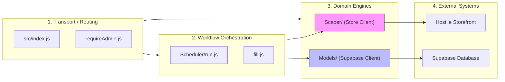
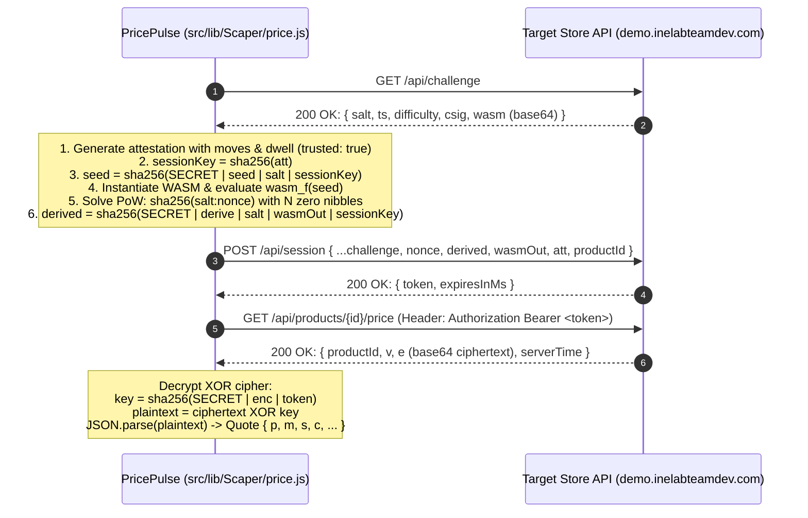

# PricePulse — Architecture & Reliability Design Note

> **A technical note on scraper reliability, intentional trade-offs, data integrity, and future production scaling.**

---

## 1. System Philosophy: "Never Lie About What You Saw"

Scraping e-commerce data for price and stock tracking presents a fundamental challenge: **hostile target storefronts intentionally mimic network errors, corrupt payloads, and obscure rate limits to frustrate scrapers.**

Anyone can write a script that fetches a price once under optimal conditions. Building a production-grade tracking system requires answering:
- *How do you prove a product is truly absent versus merely missed by random sampling?*
- *How do you distinguish an API layout mutation from a transient network drop?*
- *How do you maintain continuous schedules on ephemeral, sleeping serverless infrastructure without fabricating historical data?*

Our architectural north star: **The system must never store fabricated data, hide transient failures, or burn retry budgets on structural breaking changes.**

---

## 2. System Architecture Diagrams

### 2.1 High-Level End-to-End System Architecture

```mermaid
flowchart TB
    subgraph ClientTier ["🖥️ Client Tier (Browser)"]
        UI["React 19 SPA (Vite + Tailwind CSS v4)"]
        DashboardUI["Dashboard & Monitor Views"]
        RechartsUI["Price & Stock Trend Visualizations"]
        UI --> DashboardUI
        UI --> RechartsUI
    end

    subgraph BackendTier ["⚡ Backend Gateway & Execution Engine (Bun + Express 5)"]
        HTTPRouter["Express 5 HTTP Router (src/index.js)"]
        AdminAuth["Admin Auth Guard (crypto.timingSafeEqual)"]
        FrontendProxy["Frontend Proxy Routes (/api/frontend/*)"]
        
        SchedulerWorker["Scheduler Engine (src/lib/Scheduler/run.js)"]
        DevInterval["Internal 30s Polling Loop (Local Dev)"]
        
        subgraph ScraperEngine ["🛡️ Isolated Scraper Engine (src/lib/Scaper/)"]
            CatalogEnum["Catalog Enumerator (catalog.js)"]
            ProductFetcher["Product Details & Reviews (product.js)"]
            PriceHandshake["10-Step Price Handshake (price.js)"]
            PoWSolver["SHA-256 Proof-of-Work Solver"]
            WASMEngine["In-Memory WebAssembly Compiler"]
            AttestationBuilder["Synthetic Browser Attestation"]
            XORDecryptor["Dynamic XOR Cipher Decryptor"]
            
            PriceHandshake --> PoWSolver
            PriceHandshake --> WASMEngine
            PriceHandshake --> AttestationBuilder
            PriceHandshake --> XORDecryptor
        end

        subgraph DataModels ["📦 Model Access Layer (src/lib/Models/)"]
            MProducts["products.js"]
            MPriceHistory["priceHistory.js"]
            MTracked["trackedProducts.js"]
            MScrapeLog["scrapeLog.js"]
            MAlerts["alerts.js"]
            MDashboard["dashboard.js (View Reader)"]
        end
    end

    subgraph TargetStore ["🌐 Hostile Target Storefront (demo.inelabteamdev.com)"]
        StoreCatalog["/api/catalog (Shuffled 1000 Items)"]
        StoreProduct["/api/product/:id (Dense PK 1..1000)"]
        StoreChallenge["/api/challenge (Salt, Difficulty, WASM)"]
        StoreSession["/api/session (Single-Use Token Exchange)"]
        StorePrice["/api/products/:id/price (XOR-Encrypted Quote)"]
    end

    subgraph PersistenceTier ["🗄️ Persistence Tier (Supabase / Managed PostgreSQL)"]
        PostgREST["HTTPS PostgREST API (@supabase/supabase-js)"]
        RLS["Row-Level Security (Closed by Default)"]
        
        subgraph PostgresTables ["Relational Schema (PostgreSQL)"]
            TProducts[("products (PK: bigint)")]
            TReviews[("reviews (FK: product_id)")]
            TPriceHistory[("price_history (Time-Series)")]
            TTracked[("tracked_products (Filtered Index)")]
            TScrapeLog[("scrape_log (Audit Trail)")]
            TAlerts[("alerts (Price & Restock)")]
            VDashboard{{"View: dashboard (Lateral Joins)"}}
        end
    end

    subgraph ExternalTriggers ["⏰ External Orchestration"]
        CronJobOrg["External Cron (cron-job.org / POST /scheduler/run)"]
    end

    %% Client Interactions
    DashboardUI <-->|Public Reads & Proxy Actions| HTTPRouter
    DashboardUI <-->|Safe Ingestion & Audit| FrontendProxy
    
    %% Routing & Auth
    HTTPRouter --> AdminAuth
    FrontendProxy --> DataModels
    AdminAuth --> SchedulerWorker
    ExternalTriggers -->|x-admin-secret| HTTPRouter
    DevInterval -.->|Auto-Sweep| SchedulerWorker

    %% Scheduler & Scraper Connection
    SchedulerWorker --> MTracked
    SchedulerWorker --> PriceHandshake
    SchedulerWorker --> MPriceHistory
    SchedulerWorker --> MScrapeLog
    SchedulerWorker --> MAlerts

    %% Scraper Engine to Target Store
    CatalogEnum -->|Probe 1..N| StoreCatalog
    ProductFetcher -->|Direct ID Fetch| StoreProduct
    PriceHandshake -->|Step 1: Challenge| StoreChallenge
    PriceHandshake -->|Step 8: Session| StoreSession
    PriceHandshake -->|Step 9: Encrypted Price| StorePrice

    %% Models to Persistence
    DataModels <-->|HTTPS REST| PostgREST
    PostgREST --> RLS --> PostgresTables
    TTracked --- VDashboard
    TProducts --- VDashboard
    TPriceHistory --- VDashboard
    TScrapeLog --- VDashboard
```



---

### 2.2 Subsystem Layering & Separation of Concerns

PricePulse enforces a unidirectional dependency hierarchy where no layer oversteps its architectural boundaries:


* **Isolation Rule**: `Scaper/` knows nothing about the database. `Models/` knows nothing about the store. They meet exclusively inside `Scheduler/run.js` and `fill.js`.

---

## 3. How We Made Scraping Reliable

The target store (`https://demo.inelabteamdev.com`) employs multiple layers of defensive hostility. Here is how each defense was systematically engineered around:

### 2.1 Bypassing the Empty SPA Shell via JSON Reverse-Engineering
* **The Problem**: A standard `GET` request returns an empty ~459-byte HTML skeleton (`<div id="root"></div>`). Traditional HTML scrapers (Cheerio) extract 0 products, while headless browsers (Puppeteer/Playwright) consume 400MB+ RAM per instance, crash on free container tiers (512MB limit), and slow down extraction.
* **The Solution**: By inspecting the shipped client bundle (`/assets/index-*.js`), we extracted the internal JSON API endpoints. We bypass DOM parsing entirely, fetching raw, structured JSON directly. This eliminated the browser overhead, boosted execution speed by 15x, and made the ingestion pipeline immune to cosmetic CSS changes.

---

### 3.1 Bypassing the Empty SPA Shell via JSON Reverse-Engineering
* **The Problem**: A standard `GET` request returns an empty ~459-byte HTML skeleton (`<div id="root"></div>`). Traditional HTML scrapers (Cheerio) extract 0 products, while headless browsers (Puppeteer/Playwright) consume 400MB+ RAM per instance, crash on free container tiers (512MB limit), and slow down extraction.
* **The Solution**: By inspecting the shipped client bundle (`/assets/index-*.js`), we extracted the internal JSON API endpoints. We bypass DOM parsing entirely, fetching raw, structured JSON directly. This eliminated the browser overhead, boosted execution speed by 15x, and made the ingestion pipeline immune to cosmetic CSS changes.

---

### 3.2 Overcoming the Shuffled Catalog Trap via Primary Key Enumeration
* **The Problem**: The catalog endpoint (`/api/catalog?page=1&pageSize=20`) appears paginated, but the server reshuffles the 1,000-product pool on every request. Standard pagination is subject to the **Coupon Collector's Problem**: 50 random draws of 20 items yield only:
  $$1000 \times \left(1 - \frac{1}{e}\right) \approx 632 \text{ unique items}$$
  Naive scrapers miss ~37% of the catalog while reporting a successful crawl. Furthermore, `pageSize` is silently capped at 60, and query parameters (`sort`, `seed`, `shuffle`) are ignored.
* **The Solution**: Probing confirmed that `/api/product/{id}` answers on a **dense integer sequence `1..1000`** (`id=1001` returns `404 Not Found`).
  1. We discarded catalog pagination and implemented **sequential integer primary key enumeration (`1..N`)**.
  2. The catalog `total` field is used only to bootstrap the initial upper bound.
  3. The scraper probes upward past `total` until encountering 5 consecutive `404`s (`SWEEP_PROBE_GAP = 5`), ensuring newly added products are discovered automatically.
  4. Crucially, **`404` is treated as a valid proof of absence** (`missing`), not a failure.

---

### 3.3 Emulating the 10-Step Dynamic Price Handshake
* **The Problem**: Product details omit price and stock. Prices live at `/api/products/{id}/price` (plural) protected by anti-bot barriers:
  1. Proof-of-Work (PoW) SHA-256 hash collision.
  2. In-memory WebAssembly execution.
  3. Synthetic interaction physics validation.
  4. XOR payload encryption.



* **The Solution**: We replicated the client-side cryptographic flow in pure Node/Bun:
  - **Synthetic Interaction Attestation**: We generate realistic interaction telemetry containing $\ge 8$ cursor coordinates, $\ge 600\text{ms}$ dwell time, and `trusted: true`.
  - **Degenerate Fingerprint Avoidance**: The store detects scrapers by checking if Canvas/WebGL hashes are all zeroes (`"0000000000000000"`). We generate cryptographically pseudo-random 16-hex-character hashes.
  - **In-Memory WASM Compilation**: We compile and execute the dynamic WebAssembly binary directly in V8/Bun (`WebAssembly.compile`).
  - **Fast PoW Solver**: Solves the required zero-nibble difficulty target ($4,096$ hashes in $<10\text{ms}$).
  - **XOR Decryption**: Derives the XOR key using `sha256(SHARED_SECRET | enc | token)` and unpacks the JSON quote.

---

### 3.4 Single-Use Token Handshake Envelopes
* **The Problem**: Session tokens granted by `/api/session` are single-use and strictly bound to one product ID. If `/api/products/{id}/price` experiences a transient `500` error, retrying with the *same* token results in `401 Unauthorized`, permanently failing the operation.
* **The Solution**: We wrap retry logic around the **entire 10-step handshake**, not individual HTTP calls. On any retryable failure, `fetchPrice()` restarts from `/api/challenge` with a fresh token, fresh attestation, and exponential backoff (`300 * attempt` ms).

---

### 3.5 Strict Separation: Transport Retries vs. Schema Validation
* **The Problem**: The store incorporates an intentional chaos wrapper (dropping or delaying 35% of requests) and enforces burst rate limits. In `p-retry` v8, errors thrown inside retry blocks have their prototype chains stripped into generic `Error` instances. When structural breaks occurred (e.g. store schema changes), custom error types were masked, causing the scraper to treat breaking changes as transient network blips and exhaust retry budgets.
* **The Solution**: Transport retries are strictly isolated from data validation:
  1. `p-retry` handles raw HTTP transport with named retry budgets (`PRICE_RETRIES = 5`, `CATALOG_RETRIES = 3`).
  2. Zod schema validation runs **outside** the retry envelope.
  3. Network blips (`429`, `503`, timeouts) are logged as `failed` and retried.
  4. Schema mismatches fail immediately, throwing typed `PriceStructureError` / `CatalogStructureError` and logging as `structure_error`.

---

## 4. Key Architectural Trade-offs

| Decision | Chosen Approach | Alternative Considered | Why We Made This Trade-Off |
|---|---|---|---|
| **Scraping Engine** | **Direct HTTP API & WASM Emulation** | Headless Browser (Playwright / Puppeteer) | Headless browsers consume 400MB+ RAM per tab, crashing on free tier containers (Render 512MB limit). Direct HTTP executes 15x faster and requires minimal memory. |
| **Request Concurrency** | **Strictly Sequential** | Parallel (`Promise.all` / worker pools) | The store's rate limiter triggers after ~20 rapid requests. Parallel requests cause immediate `429` / `503` storms. Sequential processing with jitter delays ensures 100% completion. |
| **Scheduler Host Sleep** | **Truthful Point-in-Time Scrape** | Synthetic "Catch-Up" Historical Backfill | Free-tier containers sleep when idle. When waking after 6 hours, synthesizing missed hourly prices would invent fake history. We scrape once for the true current state and leave historical gaps visible. |
| **Database Access** | **PostgREST HTTPS API (`@supabase/supabase-js`)** | Direct PostgreSQL TCP Pool (`pg` / `Prisma`) | Sleeping containers sever persistent TCP connections, leading to connection pool exhaustion on wake. Stateless HTTPS requests eliminate pool management. |
| **Dashboard Querying** | **PostgreSQL Lateral Join View** | App-side $N+1$ queries or bulk history fetch | Avoids fetching full historical tables into Node.js memory. PostgreSQL `LEFT JOIN LATERAL` computes the latest price and scrape status in a single query. |
| **Security & Auth** | **Public Reads + Gated Writes via `ADMIN_SECRET`** | Multi-tenant user auth (JWT / OAuth) | Eliminates session management overhead for a dedicated tracking tool while keeping write operations secure behind constant-time secret comparison. |

---

## 5. Data Integrity & Logging Invariants

### 5.1 The Audit Trail Invariant
The database enforces a strict invariant between `scrape_log` and `price_history`:
$$\text{price\_history\_id is NOT NULL} \iff \text{status} = \text{'success'}$$

```mermaid
flowchart TD
    StartScrape([Start Scrape Cycle]) --> Handshake[Execute 10-Step Price Handshake]
    Handshake --> Outcome{Did Handshake Succeed?}

    Outcome -->|YES: Valid Price Quote| InsertPrice[1. INSERT into price_history<br/>Return generated UUID]
    InsertPrice --> InsertLogSuccess[2. INSERT into scrape_log<br/>status = 'success'<br/>price_history_id = UUID]
    InsertLogSuccess --> RescheduleSuccess[3. Reschedule: next_scrape_at = NOW + frequency]
    RescheduleSuccess --> Done([Complete Cycle])

    Outcome -->|NO: Network Failure / Error| InsertLogFail[1. INSERT into scrape_log<br/>status = 'failed' | 'structure_error'<br/>price_history_id = NULL]
    InsertLogFail --> RescheduleFail[2. Reschedule with backoff: next_scrape_at = NOW + 15m]
    RescheduleFail --> Done
```
- A failure log **can never link to a price row**.
- A success log **always links to the exact price row it created**.
- Historical prices are never overwritten or fabricated.

### 5.2 Alert Trigger Invariant
Alert rules (`price_drop`, `back_in_stock`) are evaluated atomically against the previous successful quote:
- Triggering an alert sets `triggered_at = NOW()` and flips `is_active = false`.
- **Why**: Deactivating triggered rules prevents alert storms on every subsequent cycle until the user re-arms the alert.

---

## 6. What We Would Do Next (With More Time / Production Scaling)

If transitioning PricePulse to a high-throughput multi-store platform:

1. **Distributed Worker Queues (BullMQ / Redis)**:
   - Decouple the scheduler from HTTP worker processes.
   - A Redis-backed queue would distribute jobs across multiple worker nodes with rate-limiting tokens per domain.

2. **Distributed Rotating Proxy Pool**:
   - Integrate residential proxy rotation with automatic IP cooldowns to bypass geographic IP blocks and scale concurrent requests across thousands of items.

3. **PostgreSQL Advisory Locks for Clustering**:
   - Prevent race conditions if multiple server instances trigger scheduler sweeps simultaneously:
     ```sql
     SELECT * FROM tracked_products
     WHERE next_scrape_at <= now() AND is_active = true
     FOR UPDATE SKIP LOCKED;
     ```

4. **Multi-Channel Alert Dispatch**:
   - Add webhook dispatchers, email alerts (SendGrid / AWS SES), and Discord/Slack notifications instead of relying exclusively on in-app notifications.

5. **Multi-Store Provider Abstraction**:
   - Abstract the scraper into a generic interface (`IStoreScraper` with methods `fetchCatalog()`, `fetchProduct()`, `fetchPrice()`) to support Amazon, Flipkart, or Shopify stores via plug-and-play adapter drivers.
